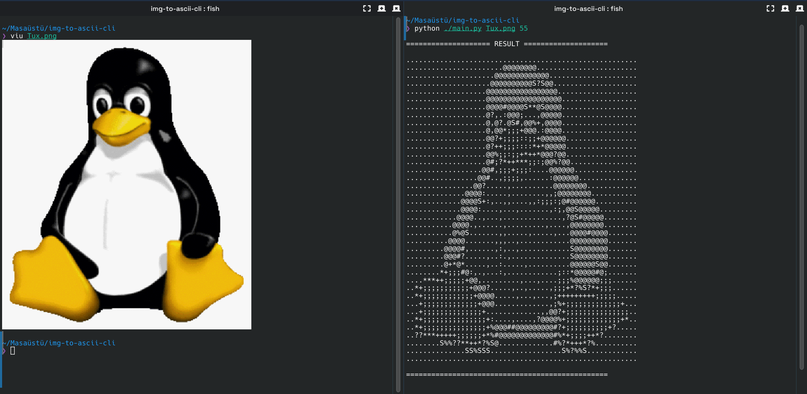

<div align="center">

# 📟 CLI Image to ASCII Converter

<p>
    <a href="https://www.python.org/">
        
    </a>
    <a href="LICENSE">
        
    </a>
    <a href="https://github.com/aliden1z/img-to-ascii-cli/issues">
        
    </a>
</p>

<p>
  <b>A minimalist Python script that renders images into ASCII art directly in your terminal.</b><br>
  No bloat, just characters. Geared towards Linux enthusiasts and CLI lovers.
</p>

[Features](#-features) • [Installation](#-installation) • [Usage](#-usage) • [License](#-license)

</div>

---

## ⚡ Features

- **Lightweight:** Zero GUI, pure terminal output.
- **Flexible:** Supports `.jpg`, `.png`, `.webp` and many more formats.
- **System Safe:** Installs dependencies in an isolated environment (`/opt`), keeping your system Python clean.
- **Native:** Fits your terminal workflow perfectly as a global command.
- **Open Source:** Modify, hack, and share.

## 🛠 Requirements

- Python 3.x
- `make` (for installation)

## 📥 Installation

This project uses a Makefile to install dependencies into an isolated virtual environment (`/opt/img-to-ascii-cli`) and creates a global command.

Clone the repository and run the install script:

```bash
git clone https://github.com/aliden1z/img-to-ascii-cli.git
cd img-to-ascii-cli
sudo make install
```

> **Note:** This installation method is safe for Arch Linux (PEP 668) and other modern distros, as it does not mess with your system-wide Python packages.

## 💻 Usage

Once installed, you can use the `img2ascii` command from anywhere in your terminal.

### 1. Standard Mode
Pass the image path as an argument. Default width is **100**.
```bash
img2ascii image.jpg
```

### 2. Custom Resolution (Recommended)
Pass the width as a second argument to fit your terminal size.

```bash
# Smaller output (for split screens)
img2ascii image.jpg 50

# High definition (maximize your terminal font size first!)
img2ascii image.jpg 200
```

### 3. Interactive Mode
Run without arguments and follow the prompts.
```bash
img2ascii
```

## 🗑 Uninstallation

If you want to remove the tool and clean up your system:

```bash
sudo make uninstall
```

## 📸 Demo

<div align="center">
  
</div>

## 🐧 License

Distributed under the MIT License. See `LICENSE` for more information.

> **Free as in freedom.** Happy Hacking!
